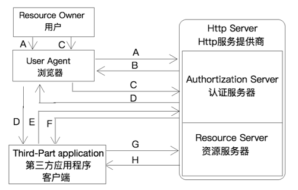

# OAuth2

## 理解OAuth2

> OAuth2是用于第三方授权登录的开放网络标准，
>
> + 官方标准参见：[rfc6749](https://tools.ietf.org/html/rfc6749) 
> + 博客参见：[(阮一峰)理解OAuth 2.0](http://www.ruanyifeng.com/blog/2014/05/oauth_2_0.html) 

### 角色

- **Third-party application**：第三方应用程序，又称"客户端"（client）
- **HTTP service**：HTTP服务提供商
- **Authorization server**：HTTP服务提供商的认证服务器
- **Resource server**：HTTP服务提供商的资源服务器
- **Resource Owner**：资源所有者，又称"用户"
- **User Agent**：用户代理，就是浏览器

### 授权模式

> OAuth 2.0定义了四种授权方式
>
> - 授权码模式
> - 密码模式
> - 客户端模式
> - 简化模式（不常用，这里不介绍）

#### 授权码模式

> 授权码模式（authorization code）是功能最完整、流程最严密的授权模式。也是qq、微信、github等大型网站使用的模式，`常用于拉取第三方授权`

   

- A

  > `客户端`在返回登录页时，会将1个向`认证服务器`请求授权的GET请求链接包含在页面中一起返回
  >
  > 当`用户`点击该链接后，`浏览器`向`认证服务器`发送1个GET请求，目的是从`认证服务器`获取1个`code`

  参数：

  - response_type：表示授权类型，必选项，此处的值固定为`code`；

    > 部分`认证服务器`不要求该参数，具体参见对应`认证服务器`的使用说明

  - client_id：表示客户端的ID，必选项；

    > 在`服务提供商`上创建应用后获得

  - redirect_uri：表示重定向URI，可选项；

    > - 用户在认证服务器上通过认证后，认证服务器会生成1个`code`返回给客户端，该参数配置的就是将`code`返回给客户端服务器时需要的回调地址
    >
    > - 如果不配置该参数，默认使用在`服务提供商`上创建应用时配置的`redirect_uri`
    >
    >   如果指定该参数，则回调地址会使用指定的`redirect_uri`，但会指定的`redirect_uri`必须与创建应用时配置的`redirect_uri`相同或是配置的`redirect_uri`的子地址
    >
    >   如：创建应用时配置的是`www.bymyself.club/login/github`
    >
    >   则指定该参数时可以指定为`www.bymyself.club/login/github`或`www.bymyself.club/login/github/test`，但是不能配置为``www.bymyself.club/login/test`

  - scope：表示申请的权限范围，可选项

    > 该参数没有备选值，由`服务提供商`自行定义可接受哪些参数

  - state：可以指定任意值，认证服务器会原封不动地返回这个值。

    > 用于防止CSRF攻击，与前面讲到的`_csrf`参数是1个东西

- B

  > `认证服务器`返回登录页面，让用户进行登录并授权

- C

  > 用户填写他在`认证服务器`上的用户名密码进行登录并进行授权

- D

  > - `认证服务器`返回1个重定向的响应
  > - 该响应会携带用户登录`认证服务器`产生的cookie
  > - 重定向地址为`${redirect_uri}?code=xxxxx&state=${state}`
  >   - redirect_uri：创建应用时或在A步中请求`认证服务器`时指定的`redirect_uri`
  >   - code：认证通过后返回的code，用于下一步客户端从`认证服务器`获取`token`
  >   - state：A步中请求`认证服务器`时指定的`state`被原封不动的返回
  > - 浏览器接收到重定向响应后直接重定向到`${redirect_uri}?code=xxxxx&state=${state}`

- E

  > 客户端使用接收到的`code`，创建应用时生成的`client_id`、`client_secret`请求认证服务器，来获取token

  参数：

  - grant_type：表示授权类型，必选项，此处的值固定为`authorization_code`；

    > 部分`认证服务器`不要求该参数，具体参见对应`认证服务器`的使用说明

  - code：上一步得到的`code`，必选项

  - redirect_uri：同A步中的`redirect_uri`，非必须

  - client_id：表示客户端的ID，必选项；

    > 在`服务提供商`上创建应用后获得

  - client_secret 表示客户端的ID对应的秘钥，必选项；

    > 在`服务提供商`上创建应用后获得

- F

  > `认证服务器`返回token以及一些其他参数

- G

  > 客户端将获得的token作为GET请求的参数或设置到请求头中，来向资源服务器获取资源
  >
  > 具体过程参见要使用的服务提供商的说明

- H

  > 资源服务器返回资源

#### 密码模式

> 密码模式就是用户将自己位于`服务提供商`的`认证服务器`上的账号密码都交给客户端，由客户端自己去申请授权并拉取资源，`常用于身份认证，不涉及第三方`（其实就是身份认证）

#### 客户端模式

> 客户端模式其实与用户没有任何关系，客户端向认证服务器发送请求来验证自己的身份，通过验证后从资源服务器获取资源

## 基于filter实现Github授权登录

> demo参见[oauth2-filter](oauth2-filter) 
>
> 测试该项目时，应该修改`hosts`文件，将`http://www.ictgu.cn`解析到`localhost`，（mac需要配置端口转发80 → 8080；其他系统应将项目启动到80端口）

## 单点登录

> 参见：[单点登录原理与简单实现](https://www.cnblogs.com/ywlaker/p/6113927.html) 

​	单点登录全称Single Sign On（以下简称SSO），是指在多系统应用群中登录一个系统，便可在其他所有系统中得到授权而无需再次登录，如：登录了`sport.bymyself.com`后再访问`food.bymyself.com`就无须再次登录了。

​	其包括`单点登录`与`单点注销`两部分

### 单点登录

 

### 单点注销

​	用户登录成功之后，会与sso认证中心及各个子系统建立会话，用户与sso认证中心建立的会话称为全局会话，用户与各个子系统建立的会话称为局部会话，局部会话建立之后，用户访问子系统受保护资源将不再通过sso认证中心，全局会话与局部会话有如下约束关系

1. 局部会话存在，全局会话一定存在
2. 全局会话存在，局部会话不一定存在
3. 全局会话销毁，局部会话必须销毁

 

## 自动配置实现Github授权登录

### 官方demo

> 教程参见：[spring官方文档](https://docs.spring.io/spring-security/site/docs/5.1.2.RELEASE/reference/htmlsingle/#oauth2login) 
>
> demo参见：[oauth2-sso/official](oauth2-sso/official) 

#### 代码

+ pom.xml

  > 添加如下依赖：

  ```xml
  <dependency>
      <groupId>org.springframework.boot</groupId>
      <artifactId>spring-boot-starter-security</artifactId>
  </dependency>
  <dependency>
      <groupId>org.springframework.security</groupId>
      <artifactId>spring-security-oauth2-client</artifactId>
  </dependency>
  ```

  > 这里使用的是`springboot2.1.1`，默认使用的是`security5.1.2`
  >
  > 其他版本的配置可能与该版本不太一样

+ application.properties

  > `security5`中内置了几种sso登录的配置，如果要配置`google`、`github`、`facebook`、`okta`的授权登录，直接配置如下两项即可

  ```properties
  spring.security.oauth2.client.registration.github.client-id=69cda57f1da3f629ecd1
  spring.security.oauth2.client.registration.github.client-secret=fdfb8ed41c0bb3ee097c8397439da0f5b684a8c4
  ```

  > 对于其他站点的授权登录，需要按如下进行配置

  ```properties
  spring.security.oauth2.client.registration.myserver.client-id=e95b54a5265186b3969b
  spring.security.oauth2.client.registration.myserver.client-secret=f4159b2968a569eac249f9e5a3b2bc0e513e2d45
  # spring.security.oauth2.client.registration.myserver.redirect-uri-template={baseUrl}/login/oauth2/code/{registrationId}
  # 等效于
  spring.security.oauth2.client.registration.myserver.redirect-uri=http://localhost:8080/login/oauth2/code/myserver
  spring.security.oauth2.client.registration.myserver.authorization-grant-type=authorization_code
  spring.security.oauth2.client.provider.myserver.authorization-uri=https://github.com/login/oauth/authorize
  spring.security.oauth2.client.provider.myserver.token-uri=https://github.com/login/oauth/access_token
  spring.security.oauth2.client.provider.myserver.user-info-uri=https://api.github.com/user
  spring.security.oauth2.client.provider.myserver.user-name-attribute=name
  ```

  + redirect-uri-template

    ​        以设置模板的方式，指定[授权码模式](#授权码模式)流程中的步骤D中的`redirectUri`，指定该项后，应用会自动生成1个使用该`uri`的接口，用于接收授权服务器返回的`code`

    ​	也可指不通过指定模板的方式进行指定，也可以通过指定`redirect-uri`属性直接指定

  + authorization-grant-type

    指定授权模式，一般都是`authorization_code`，参见[授权模式](#授权模式) 

  + authorization-uri

    [授权码模式](#授权码模式)流程中步骤A的uri

  + token-uri

    [授权码模式](#授权码模式)流程中步骤E的uri

  + user-info-uri

    [授权码模式](#授权码模式)流程中步骤G的uri

  + user-name-attribute

    指定将步骤G中资源服务器返回的响应中的哪个属性作为用户名

+ index.html

  用于展示获取到的用户信息

+ controller

  ```java
  @GetMapping("/")
  public String index(Model model,
                      @RegisteredOAuth2AuthorizedClient OAuth2AuthorizedClient authorizedClient,
                      @AuthenticationPrincipal OAuth2User oauth2User) {
      model.addAttribute("userName", oauth2User.getName());
      model.addAttribute("clientName", authorizedClient.getClientRegistration().getClientName());
      model.addAttribute("userAttributes", oauth2User.getAttributes());
      return "index";
  }
  ```

  以模范的方式返回页面

  + @RegisteredOAuth2AuthorizedClient

    用来将应用中设置的`OAuth2`客户端信息注入到其标注的参数上

  + @AuthenticationPrincipal

    用于将从`user-info-uri`返回的用户信息注入到其标注的参数上

#### 分析

+ 此时，访问`localhost:8080`将被跳转到`localhost:8080/login`页面
  + 应用默认所有接口都是需要登录的，未登录状态下访问任何接口都会跳转到登录界面，在前后端分离项目中不会自动跳转，返回状态码即可
  + `localhost:8080/login`页面是应用自动生成的，里面包含每种授权登录方式触发登陆动作的超链接，默认是`{baseUrl}/oauth2/authorization/{registrationId}`；在前后端分离项目中，后端不需要该页面，只需要在前端页面上放1个该链接即可
+ 点击页面上对应的授权登录链接，应用即可自动执行授权登录流程，最终跳转到前面要访问的页面显示出要显示的信息；在前后端分离项目中，这里应该统一跳转到`login`接口，返回本应用中用户的`token`、`权限列表`等信息
+ 注意，此应用中处于已登录状态在点击超链接触发授权登录动作会报404，这是正常的

### 源码

+ 在security配置类中调用`HttpSecurity.oauth2Login()`方法时，加载了`OAuth2LoginConfigurer`的自动配置

+ `OAuth2LoginConfigurer`类中，主要内容如下：

  + 内部类（配置端点）

    + `AuthorizationEndpointConfig`触发第三方授权端点
    + `RedirectionEndpointConfig`接收重定向请求端点
    + `TokenEndpointConfig`获取token端点
    + `UserInfoEndpointConfig`获取用户信息端点

  + init

    将`TokenEndpointConfig`中的配置配置到`OAuth2LoginAuthenticationProvider`

    将`UserInfoEndpointConfig`中的配置配置到`OAuth2UserService`

  + configure

    将`AuthorizationEndpointConfig`、`RedirectionEndpointConfig`两个端点中的配置配置到如下两个拦截器

    + `OAuth2AuthorizationRequestRedirectFilter`

      用于拦截触发请求，并返回重定向到第三方获取`code`

    + `OAuth2LoginAuthenticationFilter`

      用于拦截重定向请求，拿到`code`，并进行后续处理

+ `OAuth2AuthorizationRequestRedirectFilter`

  拦截到触发请求，并重定向到第三方获取code

+ `OAuth2LoginAuthenticationFilter`

  + 重写`attemptAuthentication`方法，调用`AuthenticationManager`的`authenticate`方法，获取验证后的用户信息（这块与基本的`security`验证思想相同）

  + 默认`AuthenticationManager`的默认实现是`ProviderManager`，该类中维护了1个provider的List集合，逐个进行验证，其中加载了`OAuth2LoginAuthenticationProvider`

+ `OAuth2LoginAuthenticationProvider`

  在`authenticate`方法中执行了如下两个动作：

  + 获取token
  + 调用`OAuth2UserService`的`loadUser`方法获取用户信息

### 结论

`spring security`内置的`oauth2`可能并不适合做微信qq等第三方的授权登录，原因如下：

+ 实现第三方授权登录，需要`绑定`、`登录`两个功能，而为了区分获取授权后要执行哪个功能，需要在触发授权登录登录工作的uri中通过参数指定，并且该参数需要跟随重定向请求并返回，或存储在应用中，一遍获取到用户信息后进行分别处理；而`spring security`内置的`oauth2`未对该参数进行处理，如果使用该方式，需要重写很多东西，不如直接使用filter的方式实现了
+ 或者配置2个第三方授权服务请求同一个第三方，一个用于绑定，一个用于登录，但是貌似不太合理

> 完全自己看源码理解的，希望不要对其他人造成误导，同时欢迎指正